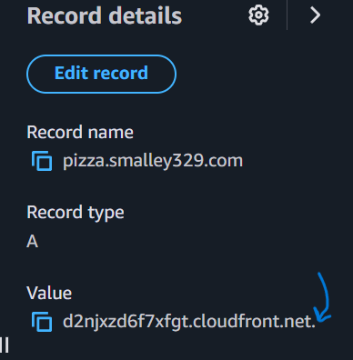
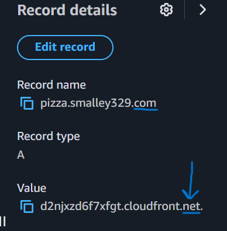
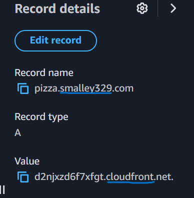
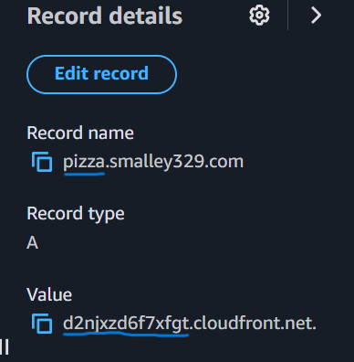

# Curiosity Report: Amazon Route 53

### Introduction
I chose to dive a bit deeper into Amazon's Route 53. Registering a domain name and setting up hosted zones piqued my interest, so I thought I would do some reading of Amazon's docs and educational material to learn a bit more about DNS.

### What's in a Domain Name?
I found a video from an AWS conference that I enjoyed watching [AWS re:Invent 2022 - Amazon Route 53: What’s in a Domain Name? A Lot. (NET206)](https://youtu.be/mczl5zhQcYQ)

One thing that I was curious about was the . at the very end of the domain name within Route 53. 

The presenter from Amazon explains that the . means the domain root. It's the very top level of the domain name that can directly answer queries for records stored in that zone.

The next level in the domain is the top level domain:

And after that is the second level domain, which is commonly just called 'the domain name':

The second level and top level domain are what are purchased and registered through a domain name registrar. Route 53 is one of the many domain name registrars.

After that, it's the third level domain:

Essentially, the third level domain is used to refer to a specific webserver within the domain, used to structure content within the website.

### Resolving Domain Names
Each of these domain levels have its own name server. Essentially, the root name server processes and resolves the root part of the request, passes the result and the rest of the ip to the top level domain server, and so on and so forth until the whole request is resolved.