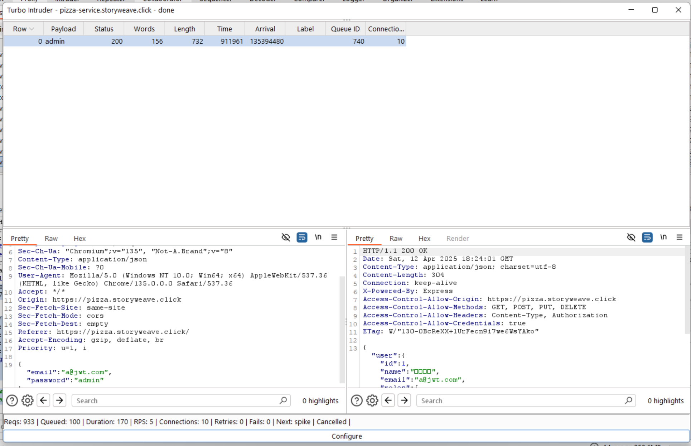
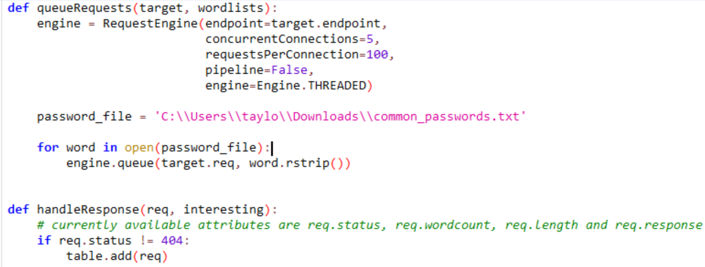
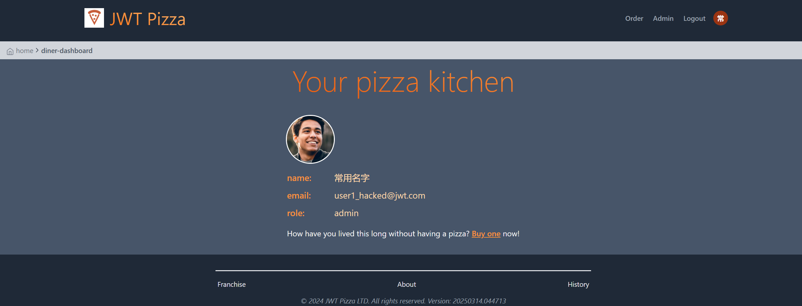
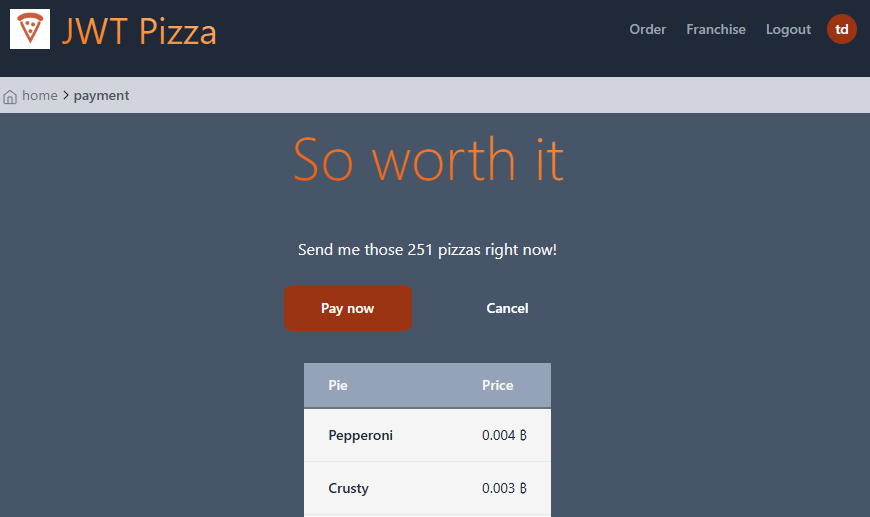
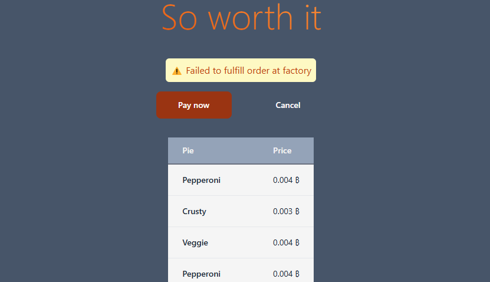

# Deliverable 12: Penetration Test

## Sarah Smalley and Taylor Smith

### Self Attack - Taylor:

| Item           | Result                                                                         |
| -------------- | ------------------------------------------------------------------------------ |
| Date           | April 12, 2025                                                                 |
| Target         | pizza.storyweave.click                                                         |
| Classification | Identification and Authentication Failures                                     |
| Severity       | 3                                                                              |
| Description    | Brute forced admin password. Gained access to the admin account. Used the top 10,000 most common passwords. |
| Images         |    200 Response indicates we found correct credentials.    Iterated through the top 10000 passwords. |
| Corrections    | All accounts now have more secure passwords, with a combination of uppercase, lowercase, numbers, and symbols. |

| Item           | Result                                                                         |
| -------------- | ------------------------------------------------------------------------------ |
| Date           | April 12, 2025                                                                 |
| Target         | pizza.storyweave.click                                                         |
| Classification | Injection                                     |
| Severity       | 4                                                                              |
| Description    | The PUT /api/auth/:userId endpoint uses string interpolation when creating it's DB query. This allows the user to inject SQL through the email or password fields. This can allow them to drop all the data in the DB. This, coupled with the knowledge that user IDs are just ints, allows someone to change the credentials on accounts by iterating through userIDs. |
| Images         |    This admin account was infiltrated, using the above method. Potentially all accounts could be changed using this method, but you really only need to go until you find an admin. |
| Corrections    | The affected endpoint no longer uses string interpolation. It uses the same query() method as the other endpoints. |

| Item           | Result                                                                         |
| -------------- | ------------------------------------------------------------------------------ |
| Date           | April 12, 2025                                                                 |
| Target         | pizza.storyweave.click                                                         |
| Classification | Insecure Design                                     |
| Severity       | 1                                                                            |
| Description    | Users are able to order as many pizzas as they want. This makes it very easy to cause errors when we try to hit our factory endpoint. This could make a DOS attack easier, or at least overwhelm our logs with meaningless errors. |
| Images         |    Here the user was able to attempt an order of 251 pizzas.    It resulted in this error. |
| Corrections    | The UI now only allows for up to 10 pizzas per order. Additionally, the endpoint will reject orders with more than 10 pizzas. |

### Self Attack - Sarah
| Item           | Result                                                                         |
| -------------- | ------------------------------------------------------------------------------ |
| Date           | April 13, 2025                                                                 |
| Target         | pizza-service.smalley329.com                                                   |
| Classification | Injection                                                                      |
| Severity       | 3                                                                              |
| Description    | SQL injection attempted, able to inject sql from update user endpoint          |
| Images         |                                                                                |
| Corrections    | Sanitize user inputs from that endpoint by adding 'fields' and 'params' arrays |

| Item           | Result                                                                         |
| -------------- | ------------------------------------------------------------------------------ |
| Date           | April 13, 2025                                                                 |
| Target         | pizza-service.smalley329.com                                                   |
| Classification | Identification and Authentication Failures                                     |
| Severity       | 1                                                                              |
| Description    | I realized that I needed to change the user information from the defaults      |
| Images         |                                                                                |
| Corrections    | Changed admin username and password, no weak testing accounts                  |

##Peer Attack - Taylor Attacking Sarah:

| Item           | Result                                                                         |
| -------------- | ------------------------------------------------------------------------------ |
| Date           | April 15, 2025                                                                 |
| Target         | pizza-service.smalley329.com                                                         |
| Classification | Identification and Authentication Failures                                     |
| Severity       | None                                                                             |
| Description    | Attempted to brute force the admin account using the 10000 most common passwords. It was unsuccessful |
| Images         |                                                                                 |
| Corrections    |  None required. |

| Item           | Result                                                                         |
| -------------- | ------------------------------------------------------------------------------ |
| Date           | April 15, 2025                                                                 |
| Target         | pizza-service.smalley329.com                                                         |
| Classification | Injection                                     |
| Severity       | None                                                                             |
| Description    | Attempted to exploit the PUT /api/auth/:userId endpoint using SQL injection. I was thwarted with a {"message":"unauthorized"} response. |
| Images         | |
| Corrections    | None required. |

### Peer Attack - Sarah Attacking Taylor:
| Item           | Result                                                                         |
| -------------- | ------------------------------------------------------------------------------ |
| Date           | April 14, 2025                                                                 |
| Target         | pizza.storyweave.click                                                         |
| Classification | Security Misconfiguration                                                      |
| Severity       | None                                                                           |
| Description    | Tried the default jwt passwords. No vulnerabilities found.                     |
| Images         |                                                                                |
| Corrections    |                                                                                |

| Item           | Result                                                                         |
| -------------- | ------------------------------------------------------------------------------ |
| Date           | April 14, 2025                                                                 |
| Target         | pizza.storyweave.click                                                         |
| Classification | Identification and Authentication Failures                                     |
| Severity       | None                                                                           |
| Description    | Tried a list of common passwords using Burp Suite attack.                      |
| Images         |                                                                                |
| Corrections    |                                                                                |

| Item           | Result                                                                         |
| -------------- | ------------------------------------------------------------------------------ |
| Date           | April 14, 2025                                                                 |
| Target         | pizza.storyweave.click                                                         |
| Classification | Insecure Design                                                                |
| Severity       | Low                                                                            |
| Description    | Found github repositories for Taylor's jwt-pizza and jwt-pizza-service, notably the penetration self-test notes |
| Images         |                                                                                |
| Corrections    |                                                                                |

| Item           | Result                                                                         |
| -------------- | ------------------------------------------------------------------------------ |
| Date           | April 14, 2025                                                                 |
| Target         | pizza.storyweave.click                                                         |
| Classification | Brute Force                                                                    |
| Severity       | None                                                                           |
| Description    | Tried to break Taylor's fix of the more than 10 pizza exploit, with no success |
| Images         |                                                                                |
| Corrections    |                                                                                |

## Combined Summary of Findings
Initially, both websites had significant account vulnerabilities due to inconsistent code when handling SQL queries, and not having strict enough rules when it comes to passwords. Luckily we were both able to fix the major issues before the attacks. This exercise demonstrates the importance of code consistency and implementing proper security measures. Neither of us were able to find any major exploits in the other’s website.